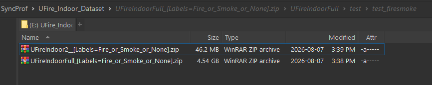

This guide outlines the environment setup and execution process for the iNet fire and smoke detection model evaluation scripts using the UFireIndoorVideo datasets.

## General Guide to Execute the Evaluation Scripts

### Prerequisites

*   **CUDA Architecture:** Version 12.9 is required. Verify your current installation using the following command:
    ```bash
    nvcc --version
    ```
*   **Operating System:** Execution within a WSL2 environment using Ubuntu 24.04 is highly recommended, though Windows environments are natively supported. For setup assistance, reference the [Ubuntu WSL2 installation guide](https://ubuntu.com/wsl/docs/stable/howto/install-ubuntu-wsl2/).

---

### Environment Setup

Project dependencies are managed using the `uv` package manager.

1. **Install Manager:** Install `uv` by following the [official installation instructions](https://docs.astral.sh/uv/getting-started/installation/).
2. **Install Dependencies:** Create and synchronize the virtual environment (`.venv`). You must append the `--extra gpu` flag to ensure PyTorch is installed with CUDA support:
    ```bash
    uv sync --extra gpu
    ```
3. **Activate Environment:** Navigate to the project root and activate the virtual environment before running any Python scripts:
    ```bash
    cd <prj_root>
    
    # For Ubuntu/WSL2
    source .venv/bin/activate
    
    # For Windows
    .venv/Scripts/activate
    ```

---

### Use case 01:  Configuration and Run Single Experiment

1. **Configure Parameters:** Modify the target YAML configuration file (e.g., `config/run_base.yaml`) to set experimental parameters. Key configurations include:
    * **Dataset Selection:** Defined via `dbset_selector.selected_dbset`.
    * **Methodology**: `method_selector.selected_method`
    * **Metrics:** `metric_selector.selected_metric`
    * **Model:** `modelCfg` which models to use, including architecture and weight path.
    * **Inference:**  `inferCfg` how the inference process, whether to save
        video outputs, CSV results, etc.

2. **Run Experiment:** Execute the evaluation script, passing your modified configuration file as an argument:

    ```bash
    python run_exp.py --cfg config/run_base.yaml
    ```
3. **Output Artifacts**: Experiment outputs are saved in the directory defined by the `general.outdir` parameter in your configuration file.

The output directory adheres to the following naming convention: `<pc_name>__<dataset_name>__<used_method_name>__<hash_value>__<timestamp>`. The `hash_value` is explicitly derived from the `extra_cfgs` parameter of the chosen method.
**Output File Registry**: experiment output sample when running `config/_run_template.yaml`: `MainPC__ds_UFireIndoor2__mt_no_temp_method__af4b0d32a3d2__20260805.151048`

| File Pattern | Description |
| :--- | :--- |
| `*_out.mp4` | Visual video outputs of the inference process. e.g. `aihub__lb_fire__0182_out.mp4` |
| `*__perf.csv` | Performance results based on the defined `metric_selector.selected_metric` (e.g., `per_frame` or `per_video`). |
| `_[*]__pred_vs_gt.csv` | Prediction versus ground truth comparisons formatted for the selected evaluation metric mode. e.g. `_[per_frame]__pred_vs_gt.csv` |
| `<<video_name>>_results.csv` | Raw, per-frame prediction data for individual videos within the target dataset. |
| `__config.yaml` | The base configuration file utilized for the active experiment. e.g. `aihub__lb_fire__0182_results.csv` |
| `__method_cfg.yaml` | The specific method configuration (`method_selector.selected_method`) applied during execution. |
| `__exp_end_summary.txt` | The final execution summary log containing run details. |


4. **Metric Calculation and Label Normalization**
    The evaluation pipeline utilizes `torchmetrics` for metric computation. To standardize the evaluation process, the framework enforces a binary classification task (`fire_smoke` vs. `none`), mapping the model's native ternary outputs (`fire`, `smoke`, `none`) into this unified format.

    This standardization is executed across the following components:

    *   **Pipeline Initialization (`src/exp.py`):** The `prepare_metrics` function explicitly sets `num_classes = 2`.
    *   **Dataset Configuration (e.g., `config/dbsets/UFireIndoorFull.yaml`):** The target dataset configuration dictates the data loading pipeline:
        ```yaml
        extra_cfgs:
            ds_metric_src: csv_metric_src 
            csv_loader_cls: base_csv_loader.BaseRawCsvLoader
        ```
    *   **Data Loading and Conversion (`src/metrics/base_metric_src`):** The
        `CsvMetricSrc` module calls `BaseRawCsvLoader` to ingest both ground
        truth and prediction CSV files. The loader executes the label
        conversion—merging `fire` and `smoke` labels into the unified
        `fire_smoke` class—and returns the normalized DataFrame to
        `CsvMetricSrc` for final metric calculation.

### Use case 02:  Configuration and Running Multiple Experiments (or Do the Parameter Optimization)

> [!note]
> To execute hyperparameter optimization, set `general.is_optim_mode: true` in your configuration file. Ensure the selected method has a corresponding parameter search space defined in a YAML file within the `config/optim/` directory. Refer to `config/run_multi.yaml` for detailed optimization guidelines.

To execute multiple experiments or conduct hyperparameter optimization,
configure the `config/run_multi.yaml` file to define the target datasets,
methodologies, evaluation metrics, and optimization state `is_optim_mode`.

Execute the batch processing script using the following command:

```bash
python run_multi.py \
    --base_yaml config/run_base.yaml \
    --sweep_yaml config/run_multi.yaml \
    --pre_computed_no_skip_dir <<path_to_precomputed_no_skip_dir>>
```

> [!note]
> **Inference Caching:** The `--pre_computed_no_skip_dir` flag is optional but highly recommended to minimize computation time. By providing a directory containing pre-computed inference results (e.g., outputs from `no_temp_method`), subsequent methods (such as `temp_method*.yaml` configurations) will bypass redundant inferences.
>
> **Example Usage:**
>
> Bash
>
> ```
> python run_multi.py --pre_computed_no_skip_dir ./zout/MainPC__ds_UFireIndoor2__mt_no_temp_method__af4b0d32a3d2__20260806.145109
> ```

The `config/run_multi.yaml` file specifies the currently supported evaluation methods:

* **`no_temp_method`:** Baseline inference without temporal skipping.
* **`temp_method_motion_block`:** Motion-based block skipping.
* **`temp_method_motion_block_eager`:** Motion-based block skipping incorporating an eager state evaluation.
* **`temp_method_streak_count_eager`:** Streak-count-based skipping with an
  eager state (i.e `temp_method_motion_block_eager`, but excludes motion detection).
* **`temp_method_window_vote_eager`:** Window-vote-based skipping with an eager state (`iNet` framework implementation by **Prof. Park**; excludes motion detection).

### Use Case 3: Cross-Run Performance Comparison Reporting

To aggregate and evaluate multiple experiment runs stored within the `zout` directory, utilize the `run_report.py` script to generate a comprehensive performance comparison report.

**Execution Command**

```bash
python run_report.py --indir ./zout --metric_cfg_file config/metrics/video_metric.yaml
```

*   **Optional Flag:** 

+ Append `--skip_plot` to bypass visual rendering (SVG generation) and strictly
  output the tabular CSV data files.
+ Append `--is_optim_report` to indicate that the report stems from optimization runs. The final output will detail the method name, dataset, performance metrics, and **hyperparameters** for each run, providing the necessary data to analyze how different configurations impact model performance.
+ Append `--outdir` to specify a custom output directory for the report files. if omitted, the default output directory will be `{indir}/__report`.

**Output Structure**
The resulting artifacts are saved to the defined `--outdir` directory and formatted as follows:

```text
__report/
 ├──    full_perf_report__per_frame.csv  # if is_optim_report flag enable
 ├──    full_perf_report__per_video.csv  # if is_optim_report flag enable
 ├──    perf_report__per_frame.csv
 ├──    perf_report__per_frame.svg
 ├──    perf_report__per_video.csv
 └──    perf_report__per_video.svg
```

## Dataset
You need to download the UFireIndoorFull and UFireIndoor2 datasets from
SyncThing folder at `SyncProf/UFire_Indoor_Dataset`




## Project Structure

The following tree structure outlines the organization of the project files and directories:

```bash
 └──    config/  # yaml files for configuring the dataset, method, metric, etc.
 └──    datasets/ # the dataset folder: UFireIndoorFull and UFireIndoor2
 └──    models/ # the model files here (.pth files)
 ├──    pyproject.toml # uv project configuration file
 ├──    run_exp.py # run  a single experiment (exp)
 ├──    run_multi.py # run mutiple exps or do the parameter optimization (optim)
 ├──    run_report.py # gen performance report for multiple exps (or optim runs)
 └──    src/ # main source code for the project
 └──    zout/ # the default output for exp runs

```
To understand the detailed project structure, please refer to the [PROJ_STRUCTURE.md](./PROJ_STRUCTURE.md) file.