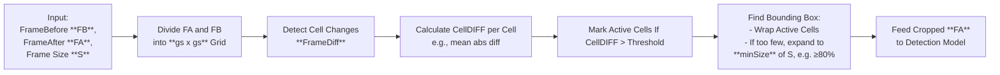

```mermaid

flowchart LR
    A[Input: <br> FrameBefore **FB**, <br>FrameAfter **FA**, <br> Frame Size **S**]
    B[Divide FA and FB <br> into **gs x gs** Grid]
    C[Detect Cell Changes <br> **FrameDiff**]
    D[Calculate CellDIFF per Cell <br> e.g., mean abs diff]
    E[Mark Active Cells If CellDIFF > Threshold]
    F[Find Bounding Box:<br>- Wrap Active Cells <br>- If too few, expand to <br> **minSize** of S, e.g. ≥80%]
    H[Feed Cropped **FA** <br> to Detection Model]
    A --> B --> C --> D --> E --> F --> H

```