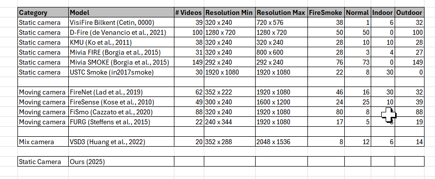

# Introduction {#sec:introduction}

<!-- !START_SYNC_BLOCK -->
<!-- TARGET_PROJECT: G:\My Drive\1_PhD\Obsidian\Home\3. Writing\paperfire2 -->
<!-- SYNC_TARGET_FILE: 01_Introduction.md-->
<!-- BLOCK_ID: intro -->

<!-- !Why matter -->

Fires and wildfires, if not detected and controlled in their early stages, can quickly
escalate --- especially under dry and windy conditions --- resulting in catastrophic
consequences including loss of life, destruction of property, and damage to natural
ecosystems. For instance, in 2017, urban fires and wildfires in California, USA, caused an
estimated economic loss of 10 billion USD [@californiafire:online]. More recently, in
2025, a forest fire in Gyeongsang Province, South Korea, burned approximately 90,000
acres, resulting in at least 27 fatalities and the evacuation of nearly 40,000 residents
[@southkoreafire:online]. Automated early-stage fire and smoke detection systems are
therefore critical for enabling timely intervention and minimizing damage.

<!-- !Existing DL approaches -->

Numerous fire and smoke detection methods leveraging deep learning (DL) have been proposed
in recent years [@cheng2024visual; @gragnaniello2024fire]. In practical deployments, these
systems are commonly applied to CCTV video streams, where DL-based classifiers or object
detectors perform inference on each frame individually. Although this frame-wise paradigm
is straightforward to implement, it exhibits two key limitations. First, it relies
exclusively on spatial information within individual frames, neglecting temporal cues ---
such as motion --- inherent in video data. Second, in surveillance scenarios, particularly
in indoor environments, consecutive frames often exhibit minimal variation due to static
scene content. Applying a DL model indiscriminately to every frame under such conditions
is computationally redundant, increasing processing cost and latency without contributing
to detection performance. This inefficiency is further compounded by the well-known
accuracy--efficiency trade-off in DL: more accurate models are generally more
computationally intensive, and redundant frame processing amplifies these demands,
rendering real-time performance difficult to achieve.

<!-- !What we propose -->

A common strategy to reduce inference cost is to substitute a heavy, high-accuracy DL
model with a lighter alternative; however, this typically degrades detection reliability
--- an unacceptable compromise in safety-critical applications such as fire and smoke
detection. This study takes a complementary approach: rather than replacing the
classifier, we introduce a lightweight skip-module that acts as a computational gate,
selectively forwarding only frames with significant scene activity to the high-capacity
classifier while bypassing static, non-informative frames. As illustrated in Fig.
\ref{fig:pipeline}, the conventional pipeline processes every frame through the
classifier, whereas the proposed pipeline inserts the skip-module upstream to
conditionally suppress redundant inference calls.

<!-- !Main Contributions -->

In particular, our main contributions are summarized as follows:

- **Skip-Module Mechanism:** We propose a lightweight skip-module that exploits motion
  estimation via frame differencing to identify static scenes and bypass DL inference on
  non-informative frames, reducing computational cost without modifying the underlying
  classifier. The module is designed as a plug-and-play component compatible with existing
  fire and smoke detection pipelines. To identify the optimal operating configuration, we
  further develop a systematic hyperparameter optimization procedure that maximizes
  throughput while preserving detection performance.

- **Indoor Fire and Smoke Video Dataset:** We construct an annotated dataset comprising
  150 indoor fire and smoke videos --- including fire, smoke, and background-only classes
  --- captured by static surveillance cameras at resolutions from 720p to 1080p. The
  dataset covers diverse environments such as warehouses, parking areas, and offices under
  varying lighting conditions, providing a realistic benchmark for evaluating detection
  systems in static surveillance scenarios.

- **Comprehensive System Evaluation:** We integrate the skip-module with a high-capacity
  DL classifier (BIG model) and evaluate the combined system on our video dataset against
  the baseline (BIG model without skipping) and existing methods. Results demonstrate a
  30% improvement in FPS with a recall reduction of less than 1%, alongside an ablation
  study that provides insights into system performance and limitations.

<!-- !Paper Organization -->

The rest of this paper is organized as follows: [@sec:relatedWork] reviews existing fire
and smoke detection methods for video and relevant motion detection techniques,
contextualizing the need for efficient processing in static surveillance scenarios.
[@sec:method] describes the proposed system architecture, the design of the skip-module,
its integration with the BIG model, and the hyperparameter optimization strategy.
[@sec:results] presents the experimental setup, evaluation metrics, and performance
results on our large-scale indoor video dataset. Finally, [@sec:conclusion] summarizes the
key findings and discusses limitations and future research directions.

<!-- !END_SYNC_BLOCK -->

# Related Work {#sec:relatedWork}

<!-- !START_SYNC_BLOCK -->
<!-- TARGET_PROJECT: G:\My Drive\1_PhD\Obsidian\Home\3. Writing\paperfire2 -->
<!-- SYNC_TARGET_FILE: 02_aRelated_work.md-->
<!-- BLOCK_ID: related -->

### Fire/smoke detection in images

Cover image-based DL classifiers and object detectors (CNNs, ViTs, YOLO variants). The
purpose is to establish what the "BIG model" builds upon and why spatial-only classifiers
are the current standard. End with a transition: these methods work well on images but
ignore temporal context when applied to video.

### Fire/smoke detection in videos

Cover video-specific methods: two-stream networks, 3D CNNs, LSTM-based temporal modeling.
Highlight that most works still apply frame-wise inference and rarely address the
computational cost in static surveillance streams.

### Efficient Video Inference: Frame Selection and Skipping

This is the most critical subsection — directly adjacent to your contribution. Cover:

Salient frame selection: selecting keyframes based on content importance

Early-exit networks: FrameExit (CVPR 2021), Stop-or-Forward (WACV 2023), which use learned
gates to skip computation

Gap to fill: all these methods target general action recognition and require training the
gate jointly with the classifier, whereas your skip-module is training-free and
plug-and-play for safety-critical fire detection

### Motion detection using background subtraction

Cover the two classical methods your skip-module builds upon:

Frame differencing: fast, training-free, sensitive to threshold

Background subtraction (MOG2, KNN): more robust to illumination changes but higher memory
cost

End with a brief justification for your design choice (e.g., why frame differencing was
chosen over background subtraction for your use case).

<!-- !Sample writing -->

**Fire and Smoke Detection in Images**: Early fire and smoke detection methods relied on
handcrafted features such as color, texture, and shape to identify fire or smoke regions
in still images [@cheng2024visual]. With the advent of deep learning, convolutional neural
networks (CNNs) have largely replaced these approaches, offering superior feature
extraction and generalization across diverse visual conditions [@gragnaniello2024fire].
More recently, object detection frameworks such as YOLOv8 and YOLOv10 have been adopted
for fire and smoke detection, enabling simultaneous localization and classification within
a single forward pass. While these models achieve high accuracy, they are computationally
intensive, with inference times on the order of tens of milliseconds per frame --- a cost
that becomes prohibitive when applied naively to continuous video streams.

**Fire and Smoke Detection in Videos**: To exploit temporal information in video, several
works have extended image-based approaches by incorporating recurrent architectures or
two-stream networks that process both appearance and motion cues jointly. Video-based
methods have demonstrated improved robustness by capturing the dynamic characteristics of
fire and smoke --- such as flickering and spreading patterns --- that are not discernible
from individual frames alone. However, the dominant deployment paradigm in practical
surveillance systems remains frame-wise inference, in which a DL classifier is applied
independently to each frame of the video stream without regard to inter-frame redundancy.
This approach disregards the temporal structure of the video and incurs unnecessary
computational cost, particularly in static indoor scenes where consecutive frames are
largely identical.

**Efficient Video Inference**: To reduce inference cost in video recognition, several
approaches have been proposed that selectively skip or early-exit frames based on
estimated content complexity. FrameExit [@frameexit2021] introduces a conditional
early-exit strategy in which a lightweight gating network, trained jointly with the main
classifier, decides at each frame whether to exit early or continue inference. Similarly,
the Stop-or-Forward framework [@stoporforward2023] employs dynamic layer skipping during
action recognition to reduce redundant computation on uninformative frames. While these
methods demonstrate significant efficiency gains, they share a critical limitation: the
gating mechanism is coupled to the underlying classifier and must be trained jointly,
making integration with a pre-trained model non-trivial. Furthermore, these methods are
designed for general-purpose action recognition tasks and have not been evaluated in
safety-critical scenarios such as fire and smoke detection, where recall requirements are
stringent.

**Motion Detection**: Motion detection provides a computationally efficient means of
identifying temporal activity in video streams without requiring deep learning. Frame
differencing computes the absolute pixel-wise difference between consecutive frames and
applies a threshold to produce a binary activity map, offering extremely low computational
overhead at the cost of sensitivity to noise and illumination changes [@framediff].
Background subtraction methods such as MOG2 and KNN model the background scene
statistically and detect foreground objects as deviations from the learned background,
providing greater robustness to gradual lighting changes at the cost of higher memory
usage [@backgroundsubtraction]. These classical techniques have been widely used as
preprocessing steps in surveillance pipelines to trigger downstream processing only when
motion is detected.

**Summary and Research Gap**: Existing DL-based fire and smoke detection systems achieve
high accuracy but apply computationally intensive inference to every video frame,
regardless of scene activity. Efficient video inference methods such as FrameExit address
redundant computation but require joint training of the gate and classifier, limiting
their applicability as plug-and-play extensions to pre-trained models. Classical motion
detection techniques, by contrast, are lightweight and training-free but have not been
systematically exploited to gate DL inference in fire and smoke detection pipelines. This
study addresses this gap by proposing a skip-module that combines lightweight motion
estimation with a pre-trained high-capacity classifier, enabling training-free inference
acceleration without sacrificing detection reliability --- as described in the following
section.

<!-- !END_SYNC_BLOCK -->

# The proposed method {#sec:method}

<!-- !START_SYNC_BLOCK -->
<!-- TARGET_PROJECT: G:\My Drive\1_PhD\Obsidian\Home\3. Writing\paperfire2 -->
<!-- SYNC_TARGET_FILE: 02_Method.md-->
<!-- BLOCK_ID: method -->

- **System Architecture:** Read Frame $\rightarrow$ Skip Module $\rightarrow$ (If active)
  BIG MODEL $\rightarrow$ Alarm.
- **Approach 1:** Naive Block Motion Analysis (Baseline filter).
- **Approach 2 (Proposed):** Block Motion combined with Color and Texture Heuristics
  designed specifically for fire and smoke.
- **The "Safety" Constraint:** The module is designed with a strict priority on near-zero
  False Negatives (maximizing Recall).The module is designed with a strict priority on near-zero
  False Negatives (maximizing Recall).fsdfsdfsdfljl32432 fdsljsdjlfsdlfsdlfsdlf ljfsdjfsdlfsdfsdlfsdfsdjf

**Image placeholders for diagrams**:

```
textSystem Architecture:
[ASCII Workflow Diagram #1]

Approach 1/2:
[ASCII Block Diagrams #2]
[ASCII Motion Grid #4]
```

```{=latex}
\input{./3.fig/fig_pipeline.tex}
```

```{=latex}
\input{./3.fig/fig_skipmodule.tex}
```

```{=latex}
\input{6.algo/frame_diff_det.tex}
```

**Frame Diff Parameter Grid Search:**

## Hyperparameter Search Space for the FrameDiffDet Skip Module

To identify an optimal configuration for the `motion_only_block_skip_proc` module using
`FrameDiffDet` as its motion estimator, we conducted a systematic grid search over four
parameters: `scale_factor`, `block_size_orig`, `block_ratio_th`, and `diff_thresh`. The
search space was defined as follows:

```{=latex}
\begin{table}[h]
\centering
\caption{Grid search space for the \texttt{FrameDiffDet} skip module hyperparameters.}
\label{tb:grid_search_space}
\begin{tabular}{ll}
\hline
\textbf{Parameter} & \textbf{Search Values} \\
\hline
\texttt{scale\_factor}   & \{0.5, 1.0\} \\
\texttt{block\_size\_orig} & \{16, 32\} \\
\texttt{block\_ratio\_th} & \{0.05, 0.10, 0.15\} \\
\texttt{diff\_thresh}    & \{3, 5, 7, 10\} \\
\hline
\multicolumn{2}{l}{\textit{Total configurations: $2 \times 2 \times 3 \times 4 = 48$}} \\
\hline
\end{tabular}
\end{table}
```

To identify an optimal configuration for the `motion_only_block_skip_proc` module using
`FrameDiffDet` as its motion estimator, we conducted a systematic grid search over four
hyperparameters: `scale_factor`, `block_size_orig`, `block_ratio_th`, and `diff_thresh`.
The search space is summarized in Table~\ref{tb:grid_search_space}, yielding a total of $2
\times 2 \times 3 \times 4 = 48$ configurations.

**`scale_factor ∈ {0.5, 1.0}`.** The scale factor controls the spatial resolution at which
per-block frame differences are computed. Full resolution (`1.0`) preserves fine-grained
pixel detail, while half resolution (`0.5`) reduces sensitivity to high-frequency pixel
noise that may generate spurious motion signals unrelated to actual scene changes. Two
levels are evaluated to quantify the effect of pre-computation downscaling on both
detection reliability and computational cost.

**`block_size_orig ∈ {16, 32}`.** Block size determines the spatial granularity of the
motion map, expressed in pixels of the original unscaled frame. Fine blocks (16 px) enable
detection of localized motion from small or nascent fire regions, whereas coarser blocks
(32 px) aggregate motion evidence over a broader spatial context, offering greater
robustness against isolated pixel-level disturbances. This range is chosen to span a
practically meaningful fine-to-coarse spectrum without becoming so coarse that spatially
small fire events are missed entirely.

**`block_ratio_th ∈ {0.05, 0.10, 0.15}`.** This threshold defines the minimum fraction of
motion-active blocks required to trigger a full inference pass; frames below this
threshold are skipped. A low value (0.05) corresponds to a conservative policy where even
sparse motion activity triggers inference, minimizing the risk of missed detections. A
higher value (0.15) reflects a more aggressive skip policy that demands broader
scene-level motion before committing to inference. The three values are spaced at a
uniform interval of 0.05 to enable a systematic and interpretable sweep across this
conservative-to-aggressive spectrum.

**`diff_thresh ∈ {3, 5, 7, 10}`.** The per-pixel difference threshold determines the
minimum absolute intensity change required for a pixel to be counted as a motion event
within a block. A low threshold (3) is highly sensitive and responds to subtle
illumination changes, while a high threshold (10) responds only to strong, unambiguous
motion. The four values are selected to span the full sensitivity spectrum — from
near-noise-level detection to robust large-motion detection — with closer spacing at the
lower end (3, 5, 7) to provide finer resolution in the sensitivity range most relevant to
fire detection, where motion tends to be subtle and spatially confined.

```{=latex}
\input{6.algo/acc_motion_det.tex}
```

<!-- !END_SYNC_BLOCK -->

# Experiments and Results {#sec:results label="results"}

<!-- !START_SYNC_BLOCK -->
<!-- TARGET_PROJECT: G:\My Drive\1_PhD\Obsidian\Home\3. Writing\paperfire2 -->
<!-- SYNC_TARGET_FILE: 03_Results.md-->
<!-- BLOCK_ID: results -->

## Experimental Setup

## Dataset Generation and Partitioning

### Image Datasets for Model Training

In this study, we trained two classification models: a high-accuracy, complex model
(referred to as the BIG model) for fire and smoke detection, and a lightweight model
(referred to as the SMALL model) for the skip-module.

For the BIG model, we combined images from the D-Fire dataset [@dfiredataset] with
additional fire and smoke images collected from the internet, resulting in a total of
18,000 images (#REVISE_NEEDED). These were divided into training (80%, 14,400 images) and
testing (20%, 3,600 images) sets.

For the SMALL model, we randomly extracted 80,000 64×64 patches from datasets A and B
(#REVISE_NEEDED). Of these, 80% were used for training, while the remaining 20% were
reserved for testing to evaluate model performance.

<!-- /mnt/e/SyncData/paper2_main/zreport/available_dataset.xlsx -->
<!-- 
There is a lack of publicly available datasets for indoor fire/smoke detection with static cameras.

Some existing fire/smoke video datasets but using moving cameras like:

- FireNet [@jadon2019firenet]
- Firesense [@Firesens4:online]
- FiSmo [@cazzolato2017fismo]
- FURG [@steffens2015unconstrained]

Static:

- DFire [@dfiredataset]
- VisiFire Blinkent [@VisiFireBilkent:online]
- KMU Fire and Smoke dataset [@KMUFireSmokeDataset]
- Mivia Fire Dataset [@foggia2015real]
- Mivia Smoke Dataset [@foggia2015real]
- USTC Smoke Dataset [@lin2017smoke]

problems:

- mostly outdoor scenes
- small number of videos
- low resolution
- lack of diversity in fire/smoke appearances and environmental conditions

we constructed our own dataset with static cameras in indoor environments to address these limitations.

- combined:
- fire/smoke videos from existing datasets
  - Korea AI Fire Dataset [@AIHub87:online]
  - USTC Smoke Dataset [@lin2017smoke]
  - VSD3K Dataset [@huang2022fire]
  - video collected from the internet (Pexels, pixabay, youtube)
- for non-fire/smoke videos:
  - some self-collected videos from real CCTV cameras in indoor environments (parking areas)
  - Safe&Unsafe behavior in workplaces dataset [@onal2024video]
  - Indoor Action dataset [@deniz2024optimized]
  - MPII Cooking 2 Dataset [@rohrbach2016recognizing]
  - USTC Smoke Dataset [@lin2017smoke]
  - WiseNet dataset [@marroquin2019wisenet]

Statistic of our indoor static video dataset shown in:
`/mnt/e/SyncData/paper2_main/zreport/my_fire_static_indoor_dataset.csv` -->

### Video Datasets for Hyperparameter Tuning and System Evaluation

Publicly available video datasets for fire and smoke detection using static cameras remain
scarce. While several existing benchmarks address this detection task — including FireNet
[@jadon2019firenet], Firesense [@Firesens4:online], FiSmo [@cazzolato2017fismo], and FURG
[@steffens2015unconstrained] — these were recorded with moving cameras and are therefore
unsuitable for static surveillance scenarios. Static-camera datasets such as DFire
[@dfiredataset], VisiFire Bilkent [@VisiFireBilkent:online], KMU Fire and Smoke
[@KMUFireSmokeDataset], Mivia Fire and Smoke [@foggia2015real], and USTC Smoke
[@lin2017smoke] do exist; however, they collectively suffer from several limitations: a
predominance of outdoor scenes, a small number of video samples, low spatial resolution,
and insufficient diversity in fire/smoke appearances and environmental conditions.

To address these deficiencies, we constructed a dedicated static indoor video dataset by
aggregating clips from multiple heterogeneous sources. Fire and smoke samples were sourced
from the Korea AI Fire Dataset [@AIHub87:online], the USTC Smoke Dataset [@lin2017smoke],
and the VSD3K Dataset [@huang2022fire], supplemented by videos collected from open online
platforms (Pexels, Pixabay, and YouTube). Non-fire/smoke (negative) samples were compiled
from self-recorded footage captured by real CCTV cameras in indoor environments (e.g.,
parking areas), along with the Safe & Unsafe Behavior in Workplaces dataset
[@onal2024video], the Indoor Action dataset [@deniz2024optimized], the MPII Cooking 2
Dataset [@rohrbach2016recognizing], and the WiseNet dataset [@marroquin2019wisenet].

Due to the lack of public high-resolution datasets specifically designed for static
surveillance cameras, we constructed a custom dataset consisting of 150 HD videos
(1920$\times$1080 resolution). The dataset is strictly balanced into three categories:
Fire (50), Smoke (50), and Safe/Neutral (50). To ensure robust evaluation, the videos
capture diverse environments, including forests, warehouses, and urban settings under
varying lighting conditions.

The 150 videos were randomly split into Training/Validation (60%, n=90: 30 Fire, 30 Smoke,
30 Safe) for hyperparameter tuning and hyperparameter selection, and Test (40%, n=60: 20
per class) for unbiased final performance evaluation. Stratified sampling ensured balance
across classes and environments.

```{=latex}
 \input{./4.table/tb_ufireindoor.tex}
```

```{=latex}
\input{./3.fig/fig_videodb.tex}
```

## Evaluation Metrics

Performance is evaluated under both **frame-level** and **video-level** protocols, which
are commonly used in fire and smoke video analysis [@steffens2016non; @dfiredataset].
Frame-level evaluation measures detection performance for each individual frame and
therefore provides a strict assessment of classification accuracy. In contrast,
video-level evaluation aggregates predictions over an entire video sequence, offering a
coarser but practically relevant measure for continuous surveillance scenarios.

The quantitative results are reported using standard classification metrics, including
accuracy, recall, false positive rate, precision, F1-score, and frames per second (FPS),
as defined below.

```{=latex}
\input{./5.eq/eq_metrics.tex}
```

In addition to these standard metrics, we emphasize a new system-level criteria that are
particularly important for the proposed skip-based framework: skip rate ($S$). Skip rate
indicates the ratio of correctly skipped negative frames $N_{\mathrm{skip}}^{-}$ to the
total number of negative frames $(TN + FP)$, reflecting the efficiency of the skip module
in filtering out non-informative frames while preserving safety.

The following definitions apply to both frame-level and video-level evaluations:

- True Positive ($TP$): Correct detection of fire or smoke.
- True Negative ($TN$): Correct identification of the absence of fire or smoke.
- False Positive ($FP$): Incorrect detection of fire or smoke when none is present.
- False Negative ($FN$): Failure to detect fire or smoke when it is present.

Frame-level evaluation computes metrics on a per-frame basis, providing a stricter
assessment, while video-level evaluation aggregates metrics in the context of entire video
sequences, allowing for a coarser assessment.

## Experimental Setup and Training {#sec:setup label="setup"}

Due to their distinct computational requirements, the BIG and SMALL models were trained on
separate hardware configurations. The BIG model was trained on a system equipped with an
Intel i9-13900K CPU and two NVIDIA GeForce RTX 4090 GPUs. Training was conducted over 100
epochs using the Stochastic Gradient Descent (SGD) optimizer with the following
hyperparameters: a batch size of 128, a learning rate of 0.01, momentum of 0.9, and weight
decay of 0.0001. In contrast, the SMALL model was trained on a system with an Intel
i9-9900K CPU and a single NVIDIA GeForce RTX 3090 GPU. This model employed the Adam
optimizer for 50 epochs with a batch size of 256, a learning rate of 0.001, \(\beta_1 =
0.9\), \(\beta_2 = 0.999\), and a weight decay of 0.0001.

**TODO**: add hardware and software context here The experiments were conducted on a
workstation running Windows 10 Pro 21H2 (build 19044) equipped with a Intel Core i9-12900K
processor, 64 GB of DDR5 system memory, and an NVIDIA GeForce RTX 3090 GPU (24 GB VRAM).
All deep learning inference was performed under CUDA 12.9 with PyTorch 2.7.1.

<!-- !MainPC -->

<!-- ha@DESKTOP-JQD9K01
OS: Windows 10 Pro (22H2) x86_64
Kernel: WIN32_NT 10.0.19045.5965
Uptime: 15 days, 13 hours, 1 min
Packages: 17 (scoop), 70 (choco)
CPU: Intel(R) Core(TM) i9-10900K (20) @ 3.70 GHz
GPU: NVIDIA GeForce RTX 3090 (23.76 GiB) [Discrete]
Memory: 36.50 GiB / 63.88 GiB (57%)
Disk (C:\): 396.30 GiB / 476.30 GiB (83%) - NTFS
Disk (D:\): 4.75 TiB / 5.46 TiB (87%) - NTFS
Disk (E:\): 776.22 GiB / 931.50 GiB (83%) - NTFS
Disk (F:\): 66.01 MiB / 10.00 GiB (1%) - NTFS [External]
Disk (G:\): 783.98 GiB / 931.50 GiB (84%) - FAT32
Disk (H:\): 783.98 GiB / 931.50 GiB (84%) - FAT32
Disk (J:\): 729.42 MiB / 3.00 GiB (24%) - NTFS [External]
Local IP (vEthernet (Internet Switch)): 115.145.67.115/24 -->

<!-- !1GPU server

comeduTa1@DESKTOP-QNS3DNF
OS: Windows 10 Pro (21H2) x86_64
Kernel: WIN32_NT 10.0.19044.3086
Uptime: 23 days, 2 hours, 16 mins
Packages: 45 (choco)
CPU: 12th Gen Intel(R) Core(TM) i9-12900K (24) @ 3.19 GHz
GPU 1: Microsoft Remote Display Adapter
GPU 2: NVIDIA GeForce RTX 3090 (23.76 GiB) [Discrete]
Memory: 17.99 GiB / 63.75 GiB (28%)
Disk (C:\): 1.10 TiB / 1.82 TiB (61%) - NTFS
Disk (D:\): 1.43 TiB / 1.82 TiB (79%) - NTFS
Disk (E:\): 1.40 TiB / 7.28 TiB (19%) - NTFS
Local IP (115.145.36.213/24)
NVIDIA-SMI 575.51.02              Driver Version: 576.02         CUDA Version: 12.9
torch 2.7.1+ cu118


The experiments were conducted using a Windows 10 Pro 22H2 operating system with 64 GB of
RAM and two NVIDIA GeForce RTX 3090 GPUs, each with 24 GB of VRAM. The NVIDIA CUDA
Toolkit version 11.8 was used in conjunction with PyTorch 2.1.0 for training YOLO models. -->

<!-- !4GPU server -->

<!-- comeduta5@DESKTOP-Q2IKLC0
OS: Windows 10 Pro (22H2) x86_64
Kernel: WIN32_NT 10.0.19045.6456
Uptime: 92 days, 5 hours, 58 mins
Packages: 35 (choco)
CPU: 2 x Intel(R) Xeon(R) Silver 4210R (40) @ 4.00 GHz
GPU 1: NVIDIA GeForce RTX 3090 (23.76 GiB) [Discrete]
GPU 2: Microsoft Remote Display Adapter
GPU 3: Microsoft Basic Display Adapter [Integrated]
GPU 4: NVIDIA GeForce RTX 3090 (23.76 GiB) [Discrete]
GPU 5: NVIDIA GeForce RTX 3090 (23.76 GiB) [Discrete]
GPU 6: NVIDIA GeForce RTX 3090 (23.76 GiB) [Discrete]
Memory: 24.69 GiB / 127.63 GiB (19%)
Disk (C:\): 574.13 GiB / 975.92 GiB (59%) - NTFS
Disk (D:\): 260.78 GiB / 446.62 GiB (58%) - NTFS
Disk (E:\): 898.97 GiB / 1.23 TiB (71%) - NTFS
Local IP (NIC1): 115.145.36.212/24

All inference latencies were measured on an NVIDIA Jetson Nano / RTX 3060 to simulate edge deployment -->

## Baseline Models and Context

To validate the effectiveness of the proposed skip module, we compare it against a
spectrum of existing solutions ranging from heavy, high-accuracy models to lightweight,
real-time approximations:

- **The "Expert" Baseline (BIG MODEL):** A state-of-the-art Deep Learning model (ResNet-50
  backbone) trained on a massive proprietary dataset ($>1M$ images). It achieves the
  highest accuracy but suffers from high latency ($\sim$50ms/frame), making it
  computationally prohibitive for 24/7 processing on edge devices.

<!-- !TO EDIT: AI gen -->

We construct a binary image classification dataset for fire and smoke detection,
consisting of two classes: _fire/smoke_ and _none_. The dataset contains 18,500 RGB images
collected from publicly available sources, including FIRE Dataset and FIRESENSE Dataset,
along with additional web-scraped images. The _fire/smoke_ class includes images with
visible flames or smoke under diverse conditions such as indoor fires, wildfires, and
low-visibility environments, while the _none_ class contains visually similar non-fire
scenes (e.g., fog, clouds, and sunlight glare) to reduce false positives. The images vary
in resolution from (480 \times 360) to (1920 \times 1080), and the dataset is split into
70% training, 10% validation, and 20% testing subsets with balanced class distribution.
Prior to training, all images are resized to (224 \times 224) and normalized using
ImageNet statistics, and data augmentation techniques including random horizontal
flipping, rotation (±15°), color jittering, and random cropping are applied to improve
robustness to variations in illumination, scale, and viewpoint. The model is implemented
using PyTorch and trained on a single NVIDIA RTX 3090 GPU. Optimization is performed using
the Adam optimizer with an initial learning rate of (1 \times 10^{-4}) and weight decay of
(1 \times 10^{-5}), and the model is trained for 100 epochs with a batch size of 32. A
cosine annealing learning rate schedule with a 5-epoch warm-up is employed to stabilize
training, and gradient clipping with a maximum norm of 5.0 is applied to prevent
instability. The training objective is binary cross-entropy loss, and model selection is
based on validation F1-score, with early stopping applied if performance does not improve
for 10 consecutive epochs. Final performance is reported on the held-out test set using
accuracy, precision, recall, and F1-score.

- **M1 (Lightweight Classifier) [@jadon2019firenet]:** A MobileNetV2-based classifier
  trained on a smaller subset ($<5k$ images). It represents the standard "efficiency"
  compromise: low latency ($\sim$15ms) but reduced generalization capability.
- **M2 (Lightweight Detector) [@pedrovin2023HybridMethodFire]:** A YOLOv8-Nano object
  detector trained on a small dataset ($\sim$2k images). It offers localization but
  struggles with small or semi-transparent smoke features due to limited training data.
- **M3 (Temporal Voting Method) [@pedrovin2023HybridMethodFire]:** A video-level approach
  that aggregates inference results over a sliding window of 30 frames to reduce false
  alarms. While effective for reducing noise, it introduces inherent algorithmic latency.

## Hyperparameter Selection Strategy {#sec:hyperparam}

To select the optimal hyperparameters for the proposed skip module, we employ a
constrained optimization procedure on the validation set. Let $R_{\text{base}}$,
$\mathrm{FAR}_{\text{base}}$, and $T_{\text{DL}}$ denote the end-to-end recall, false
alarm rate, and mean per-frame inference time of the baseline pipeline (without skipping),
respectively. For each candidate parameter set $\theta \in \Theta$ obtained by grid
search, we evaluate the full pipeline $\text{Read} \rightarrow \text{Skip}(\theta)
\rightarrow [\text{DL}]$ and compute four metrics: recall $R(\theta)$, false alarm rate
$\mathrm{FAR}(\theta)$, negative-frame skip ratio $S(\theta)$, and mean per-frame skip
module time $T_{\text{skip}}(\theta)$.

The negative-frame skip ratio is defined as

$$ S(\theta) = \frac{\#\ \text{correctly skipped negative frames}} {\#\ \text{total
negative frames}}. $$

The mean per-frame inference times are defined as

$$ T_{\text{DL}} = \frac{1}{|D_{\text{val}}|} \sum_{i=1}^{|D_{\text{val}}|}
t_{\text{DL}}(f_i), \qquad T_{\text{skip}}(\theta) = \frac{1}{|D_{\text{val}}|}
                \sum_{i=1}^{|D_{\text{val}}|} t_{\text{skip}}(f_i,\theta), $$

where $f_i$ denotes the $i$-th frame in $D_{\text{val}}$, and both averages are taken over
all frames to reflect the runtime cost on a typical video stream.

**Feasibility constraints.** A candidate $\theta$ is considered feasible only if it
satisfies two hard constraints:

$$ R(\theta) \geq R_{\text{base}} - \delta_R, \qquad T_{\text{skip}}(\theta) \leq \beta
\cdot T_{\text{DL}}, $$

where $\delta_R = 0.01$ is the maximum allowable absolute recall drop (1%), and $\beta =
0.10$ ensures that the skip module overhead does not exceed 10% of one full DL inference.
The first constraint prevents unsafe degradation in fire/smoke detection. The second
ensures the skip module does not negate the efficiency it is designed to provide.

**Scoring feasible candidates.** To rank feasible candidates, we define two normalized
scoring terms. The false alarm reduction term is

$$ F(\theta) = \max\left(0,\; \frac{\mathrm{FAR}_{\text{base}} - \mathrm{FAR}(\theta)}
{\mathrm{FAR}_{\text{base}}}\right), $$

which measures relative FAR improvement with respect to the baseline. The recall retention
term is

$$ \rho(\theta) = 1 - \frac{R_{\text{base}} - R(\theta)}{\delta_R}, $$

which equals $1$ when the candidate matches baseline recall and $0$ when recall reaches
the lowest acceptable level $R_{\text{base}} - \delta_R$. Both terms map to $[0,1]$ over
the feasible region, making them directly comparable to $S(\theta)$ in the weighted score.

**Optimal selection.** The optimal parameter set $\theta^*$ is selected as

$$ \theta^* = \arg\max_{\theta \in \Theta_{\text{feasible}}} \left[ w_S\, S(\theta) +
w_F\, F(\theta) + w_R\, \rho(\theta) \right], $$

where $\Theta_{\text{feasible}} = \{\theta \in \Theta : R(\theta) \geq R_{\text{base}} -
\delta_R \text{ and } T_{\text{skip}}(\theta) \leq \beta \cdot T_{\text{DL}}\}$, and the
nonnegative weights satisfy $w_S + w_F + w_R = 1$. In this work, we set

$$ w_S = 0.60, \qquad w_F = 0.20, \qquad w_R = 0.20, $$

so that skip ratio remains the primary efficiency objective, while false alarm reduction
and recall retention are treated as secondary but explicitly rewarded preferences.

**Theoretical justification.** The skip module acts as a conservative gate: skipped frames
output "negative" directly, while passed frames are processed by the same downstream
detector as the baseline. Therefore, every false alarm produced by the skip-enabled system
is also present in the baseline system, implying $\mathrm{FAR}(\theta) \leq
\mathrm{FAR}_{\text{base}}$. The main safety risk is recall degradation due to incorrectly
skipped fire/smoke frames (false skips), which motivates enforcing the recall constraint
as a hard gate before any ranking is performed.

```{=latex}
\input{./6.algo/hyperparam_algo.tex}
```

Table~\ref{tb:val_search} specifies the search space for the rule-based skip-module
parameters. The ranking and selection of the optimal configuration ($\theta^*$) based on
the validation set results are detailed in Table~\ref{tb:val_results}.
Table~\ref{tab:skip-selection} shows an example of the validation-time ranking. The
selected configuration $\theta_1^*$ satisfies the recall constraint and achieves the
highest composite score by jointly balancing skip ratio, false alarm reduction, and recall
retention.

```{=latex}
\input{./4.table/tb_val_search.tex}
```

```{=latex}
\input{./4.table/tb_val_results.tex}
```

```{=latex}
\input{./4.table/tb_hyperparam_example.tex}
```

This formulation is systematic, interpretable, and aligned with the intended role of the
skip module in real-time fire/smoke detection: preserve recall first, then prefer
candidates that skip more negative frames while still improving operational false alarm
behavior.

## Component Analysis: Efficacy of the Skip Module {#sec:comp-perf}

First, we evaluate the skip modules in isolation to ensure they function as safe
gatekeepers. The primary objective is to maximize the Filter Rate without compromising
Recall. Because the ultimate goal of the system is simply to detect whether _any_ hazard
exists (regardless of whether it is fire or smoke), we measure safety using a unified
anomaly recall metric. We also compare this against the recall capabilities of the
lightweight standalone models (M1 and M2).

Table \ref{tb:tb_no_skip_perf} assesses the intrinsic recall and filtering capability of
each method as a standalone component.

```{=latex}
\input{./4.table/tb_no_skip_perf.tex}
```

_Analysis:_ As demonstrated in Table \ref{tb:tb_no_skip_perf}, lightweight standalone
models (M1 and M2) offer fast processing but miss between 11% and 15% of critical anomaly
events. Approach 1 (Naive Motion) operates extremely fast (1.2ms) but struggles with the
slow, diffusing nature of smoke. This deficiency drags its overall combined Recall down to
97.2%—an unacceptable safety margin for early-warning systems. Conversely, our proposed
Approach 2 integrates color and texture heuristics to successfully capture both rapid
flames and semi-transparent smoke. It achieves a near-perfect combined Recall of 99.1%
while actually improving the Filter Rate to 72.1% by effectively distinguishing true
anomaly indicators from environmental noise (e.g., swaying trees).

## System-Level Performance: Frame-Based Efficiency {#sec:e2e-perf}

We subsequently integrated the skip modules into the full inference pipeline to measure
end-to-end efficiency. System latency for our method is calculated as the inherent skip
module overhead plus the conditional latency of the BIG MODEL applied only to unskipped
frames.

The overall impact of integrating the skip modules into the full detection pipeline is
quantified in Table \ref{tb:e2e_perf} (frame-level accuracy/latency), also comparing
against the baseline system without skipping.

```{=latex}
\input{./4.table/tb_e2e_perf.tex}
```

_Analysis:_ Simply replacing the BIG MODEL with lightweight alternatives (M1, M2) results
in an unacceptable 17-22% degradation in F1-Score. Our proposed pipeline (Approach 2 + BIG
MODEL) successfully bridges this gap. By filtering 72.1% of frames at a cost of only 2.5ms
per frame, the average system latency drops to 16.5ms. This achieves a 67% reduction in
computational cost, tripling the effective frame rate from 20 FPS to 60 FPS while
perfectly matching the Baseline's 98.5% F1-Score.

## Comparison with Temporal Methods (M3) {#sec:cmp-temporal}

A critical distinction in anomaly detection is between frame-level and video-level
processing. The M3 baseline reduces false alarms by executing majority voting across a
30-frame window. While highly accurate, this architectural choice introduces significant
latency.

Table \ref{tb:cmp_base_temp} compares our method against other temporal processing
techniques, evaluating both detection performance and computational efficiency.

```{=latex}
\input{./4.table/tb_cmp_base_temp.tex}
```

_Analysis:_ Because M3 requires a full temporal buffer before confirming an event, the
system inherently delays the alarm trigger by over 750ms. In contrast, our frame-level
approach triggers the BIG MODEL immediately upon detecting heuristic indicators. This
results in a time-to-first-alarm of approximately 52.5ms, making our method over 14 times
faster to react than temporal aggregation methods. Even when evaluated strictly on
video-level metrics, our skip-module approach achieves higher recall and requires
significantly less aggregate computational time per second of video, proving highly
competitive in false alarm suppression.

## Ablation and Qualitative Analysis

To isolate the impact of our specific heuristic rules, we conducted an ablation study
comparing the naive motion baseline (Approach 1) against the full rule-based engine
(Approach 2). While Approach 1 performed adequately for dynamic, rapidly flickering fires,
its recall dropped significantly on smoke events. Because smoke diffuses slowly and lacks
sharp edge transitions, naive background subtraction thresholds frequently misclassified
it as static background lighting changes.

The integration of the rule-based engine in Approach 2—specifically the grayish-color
tracking and temporal texture consistency rules—corrected this deficiency, bridging the
gap in Recall. This quantitative improvement is supported by qualitative reviews of edge
cases (see Figure 4).

_(Insert Figure 4 here: 2x2 grid showing a frame with smoke missed by Appr 1 but caught by
Appr 2, and a safe frame with swaying trees flagged by Appr 1 but skipped by Appr 2)._

As illustrated in Figure 4, Approach 2 successfully captures slow-diffusion smoke events
that lack the raw pixel displacement required to trigger Approach 1. Furthermore, in
scenes featuring subtle twilight illumination shifts and swaying foliage, Approach 1
frequently generated false positives (unnecessarily passing safe frames to the BIG MODEL).
Approach 2 successfully filtered these frames by applying color-channel heuristics,
verifying that the moving pixels did not match the chromatic signatures of either fire or
smoke.

## Speed of Skip Module

```{=latex}
\input{./3.fig/fig_fps_increase.tex}
```

<!-- !END_SYNC_BLOCK -->

# Discussion {#sec:discussion label="Discussion"}

<!-- !START_SYNC_BLOCK -->
<!-- TARGET_PROJECT: G:\My Drive\1_PhD\Obsidian\Home\3. Writing\paperfire2 -->
<!-- SYNC_TARGET_FILE: 04_Conclusion.md-->
<!-- BLOCK_ID: discussion -->

_(Focus on the "Why" and the "Limits")_ The empirical results demonstrate that the
bottleneck in high-accuracy continuous surveillance is the redundancy of the input data,
not the deep learning model itself. By successfully identifying and dropping
non-informative frames at the edge, our proposed module enables the deployment of
computationally heavy, expert-level models on resource-constrained hardware.

**Limitations and Generalization:** While Approach 2 proved highly robust, the reliance on
color heuristics means the system is currently constrained to daytime or well-lit
surveillance. In zero-light environments utilizing IR cameras, the red-channel heuristics
for fire detection would fail, requiring a fallback to pure motion or thermal thresholds.
Furthermore, extreme weather conditions such as heavy, moving fog can mimic the grayish
diffusion of smoke, occasionally leading to false positives that reduce the overall Filter
Rate.

<!-- !END_SYNC_BLOCK -->

# Conclusion {#sec:conclusion label="Conclusion"}

<!-- !START_SYNC_BLOCK -->
<!-- TARGET_PROJECT: G:\My Drive\1_PhD\Obsidian\Home\3. Writing\paperfire2 -->
<!-- SYNC_TARGET_FILE: 04_Conclusion.md-->
<!-- BLOCK_ID: conclusion -->

We proposed a lightweight, plug-and-play skip module designed to accelerate real-time fire
and smoke detection in static surveillance systems. By combining block-based motion
analysis with targeted color and texture heuristics, our module safely filters out up to
72% of irrelevant background frames without compromising safety. Extensive evaluations
demonstrate that our approach achieves a 3$\times$ system speedup and a 67% reduction in
computational cost, while fully preserving the near-perfect accuracy (98.5% F1-Score) of
heavy deep learning models. Future work will focus on integrating adaptive, unsupervised
thresholding to dynamically adjust heuristic rules based on real-time environmental
lighting and weather shifts.

<!-- !END_SYNC_BLOCK -->

# References {#sec:references label="bibliography"}
